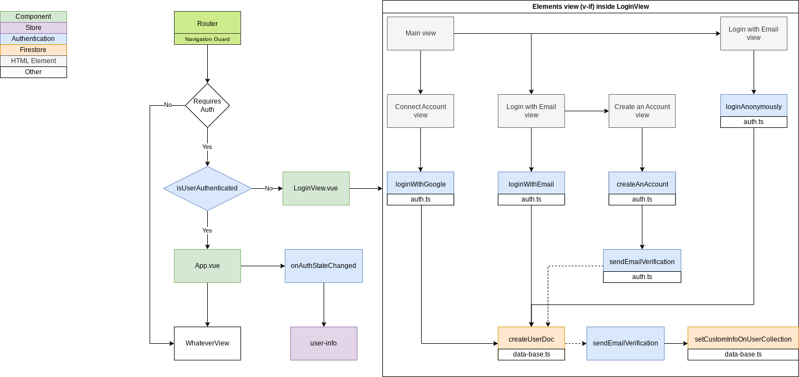

# Sobre o repositório

Esse repositório guarda os arquivos do meu [projeto de lista de compras 🡥](https://lista-de-compras.andremourasantos.com.br), que iniciei no começo de 2023 como forma de aprofundar e aplicar meus conhecimento com o Firebase V9 JS SDK e também Powered Web App (PWA).

> Esta nova versão finaliza o ciclo de versões de teste desta aplicação, formalizando meu aprendizado em um produto consico e 100% funcional.

---

## Tecnologias usadas

_*Atualizado em outubro de 2023._

  
  
  
  
  
  
  
  

---

## O que aprendi com este projeto?

Texto.

---

## Árvore de componentes e lógica

_*Atualizado em outubro de 2023._

Veja abaixo a árvore de componentes do VueJs e também o fluxograma de lógica da aplicação, assim, você poderá ter um bom entendimento de como o projeto foi estruturado desde o começo para permitir uma fácil manutenção e adição de funcionalidades.

---

## Fotos do projeto

_*Atualizado em outubro de 2023._

---

## Desempenho do site

_*Atualizado em outubro de 2023._

O desempenho do site pode ser visto a partir de testes do [PageSpeed Insights 🡥](https://pagespeed.web.dev/analysis?url=https%3A%2F%2Flista-de-compras.andremourasantos.com.br%2F).

---